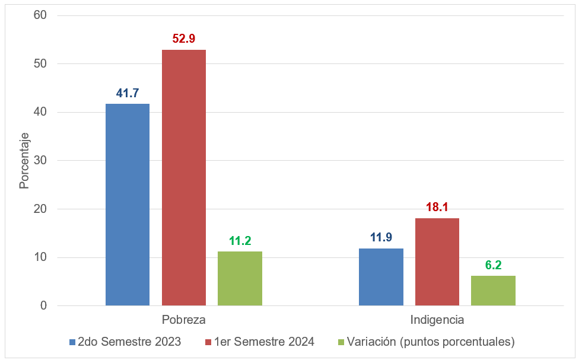
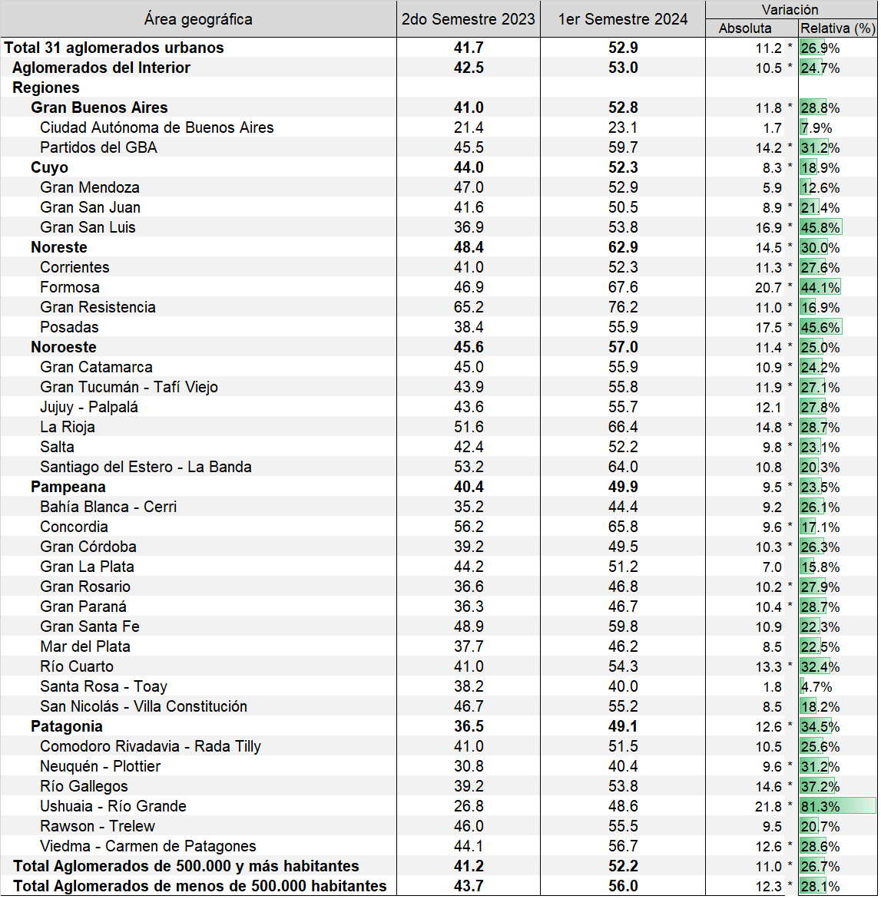
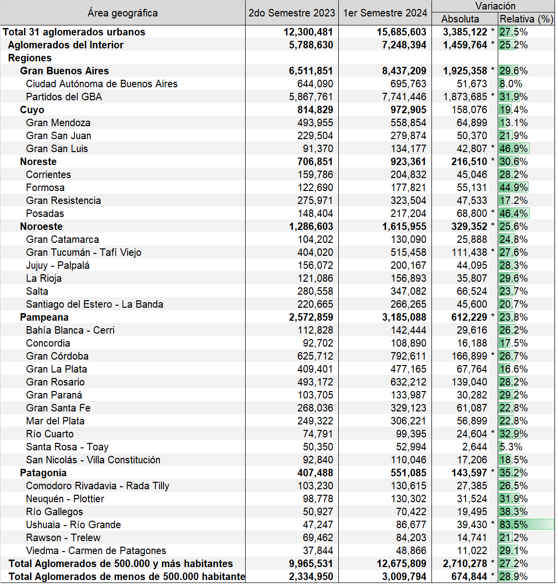
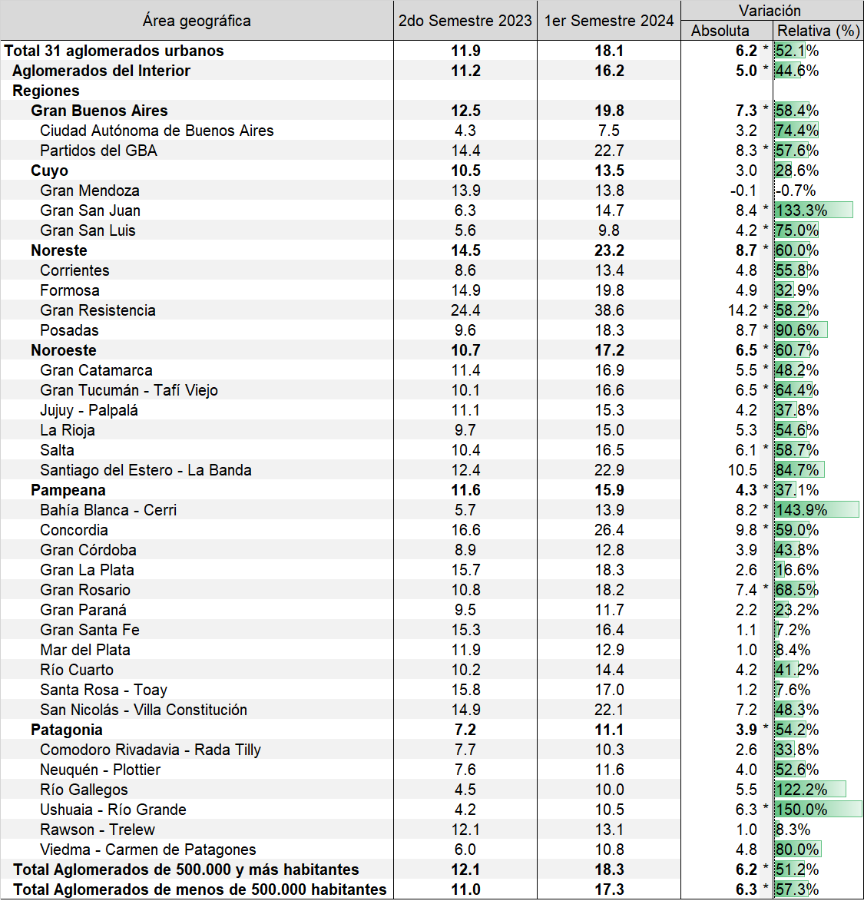
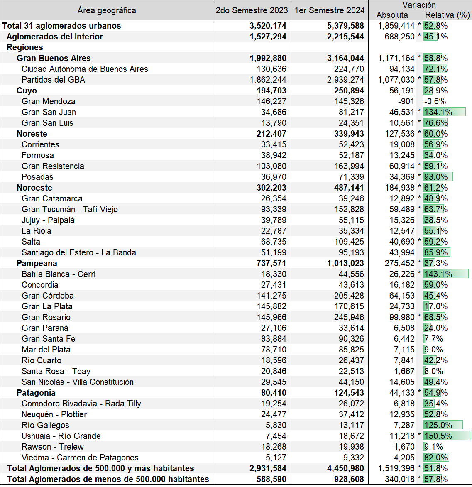
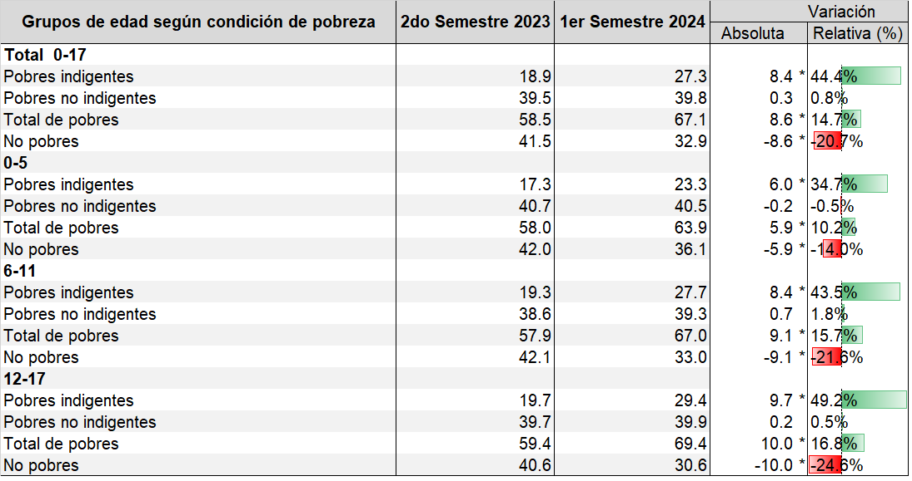

<style>
p {
    font-size: 20px;
    line-height: 28px;
    margin: 0px 0px 12px 0px;
}

h1, h2, h3, h4, h5, h6, legend {
    font-family: Arial, sans-serif;
    font-weight: 700;
    color: #9F2042;
}
</style>

```{r setup, include=FALSE}
knitr::opts_chunk$set(echo = TRUE)
options(knitr.kable.NA = '')
library(tidyverse)
library(kableExtra)
library(plotly)
library(knitr)
library(readxl)
```

**En el primer semestre de 2024, en el total de los 31 aglomerados urbanos capturados por la Encuesta Permanente de Hogares, la tasa de pobreza fue de 52.9 por ciento y la de indigencia 18.1 por ciento. Esto implica un aumento de 11.2 puntos porcentuales en la pobreza y de 6.2 puntos porcentuales en la indigencia comparadas con el segundo semestre de 2023.**

**Figura 1. Incidencia de la Pobreza y la Indigencia (en porcentaje). Total de Aglomerados**
```{r fig1screenshot, echo=FALSE, fig.cap="Fuente: elaboración propia a partir de la Encuesta Permanente de Hogares (EPH)", out.width = '100%'}

```

Los aumentos en las incidencias de la pobreza y la indigencia son estadísticamente significativos (Cuadros 1 y 3) e implican que alrededor de 3.4 millones de personas pasaron a vivir en hogares urbanos pobres y 1.8 millones pasaron a vivir en hogares indigentes entre el segundo semestre de 2023 y el primero de 2024 (Cuadros 2 y 4). Estos números indican que **en el primer semestre de 2024 hay 15.7 millones de personas que viven en hogares urbanos pobres y 5.4 millones de personas que viven en hogares indigentes.** El aumento en la pobreza fue impulsado por las regiones del norte del país. En la región Noreste la tasa de pobrezá alcanzó casi 63 por ciento mientras que en la región Noroeste fue de 57 por ciento. En el otro extremo se encuentra la Patagonia donde la incidencia de la pobreza fue de alrededor del 49 por ciento. El aumento en la indigencia se explica por lo ocurrido en la región Noreste y en el Gran Buenos Aires donde las tasas de indigencia fueron de 23.2 y 19.8 por ciento, respectivamente. En el Gran Buenos Aires, la tasa de indigencia estuvo influenciada por lo sucedido en los partidos del conurbano bonaerense donde esta tasa fue del 22.7 pr ciento. 

**Pobreza e Indigencia por Área Geográfica**

**Región del Gran Buenos Aires:** el aumento en la pobreza y la indigencia se explica principalmente por la situación en los partidos del conurbano bonaerense donde la tasa de pobreza pasó de 45.5 a 59.7 por ciento y la de indigencia de 14.4 a 22.7 por ciento. En la Ciudad Autónoma de Buenos Aires la pobreza aumentó 1.7 y la de indigencia 3.2 puntos porcentuales (Cuadros 1 y 3). El aumento de la pobreza en los partidos del conurbano implicó que en el primer semestre de 2024 haya 1.9 millones de personas más, que en el segundo semestre de 2023, que viven en hogares pobres (Cuadro 2).

**Región Cuyo:** la incidencia de la pobreza se incrementó 8.3 puntos porcentuales entre el segundo semestre de 2023 y el primero de 2024. El aumento fue impulsado por el aglomerado del Gran San Luis, donde la pobreza aumentó casi 17 puntos porcentuales. Por otro lado, en el Gran Mendoza la pobreza se mantuvo estable, en términos poblacionales, en la comparación con el segundo semestre de 2023 (Cuadro 1). En esta región, el aumento de la indigencia no resultó estadísticamente significativo en la comparación con el segundo semestre de 2023. Contribuyó a este resultado la caída, aunque no estadísticamente significativa, de la indigencia en el Gran Mendoza.

**Región Noreste:** la tasa de pobreza aumentó 14.5 y la de indigencia 8.7 puntos porcentuales entre el segundo semestre de 2023 y el primero de 2024. Es la región con las mayores tasas de pobreza, 62.9 por ciento, y de indigencia, 23.2 por ciento, del país (Cuadros 1 y 3). El aumento en la pobreza se explica por un incremento de la pobreza en todos los aglomerados de la región (Cuadro 1) mientras que el aumento de la indigencia fue impulsado en primer lugar por el aglomerado Gran Resistencia donde aumentó 14.2 puntos porcentuales y alcanzó un valor de 38.6 por ciento, seguido del aglomerado Posadas donde aumentó 8.7 puntos porcentuales (Cuadro 3).  El aumento de la pobreza en la región implicó que más de 216 mil personas pasaron a vivir en hogares pobres entre el segundo semestre de 2023 y el primero de 2024 (Cuadro 2).

**Región Noroeste:** la tasa de pobreza pasó de 45.6 a 57.0 y la indigencia de 10.7 a 17.2  por ciento entre el segundo semestre de 2023 y el primero de 2024. El aumento en la indigencia fue impulsado por los aglomerados de Gran Catamarca, Gran Tucumán - Tafí Viejo y Salta; mientras que el aumento de la pobreza se explica por estos aglomerados más el de La Rioja (Cuadros 1 y 3). 

**Región Pampeana:** la tasa de pobreza aumentó 9.5 puntos porcentuales en la comparación con el segundo semestre de 2023 alcanzando casi 50 por ciento; mientras que la incidencia de la indigencia llegó al 15.9 por ciento en el primer semestre de 2024 (Cuadros 1 y 3). El aumento de la pobreza fue heterogéneo en los aglomerados que componen la región. Mientras que en el aglomerado de Río Cuarto la pobreza creció más de 13 puntos porcentuales y en Concordia, Gran Córdoba, Gran Rosario y Gran Paraná aumentó alrededor de 10 puntos porcentuales, en el resto de los aglomerados se mantuvo estable (Cuadro 1). La tasa de indigencia llegó a casi 16 por ciento en el primer semestre de 2024 impulsada por el aumento en los aglomerados de Bahía Blanca - Cerri, Concordia y Gran Rosario (Cuadro 3).

**Región Patagonia:** la ´pobreza aumentó 12.6 y la indigencia 3.9 puntos porcentuales en comparación con el segundo semestre de 2023. Ambos aumentos resultaron estadísticamente significativos (Cuadros 1 y 3). En términos poblacionales, salvo por los aglomerados de Comodoro Rivadavia- Rada Tilly y Rawson - Trelew, la pobreza aumentó en el resto de los aglomerados de la región (Cuadro 1). El aumento de la indigencia fue impulsado por el aumento en el aglomerado de Ushuaia - Río Grande donde pasó de 4.2 a 10.5 por ciento entre el segundo semestre de 2023 y el primero de 2024 (Cuadro 3).

**Cuadro 1: evolución de la pobreza por aglomerado**
```{r fig2screenshot, echo=FALSE, fig.cap="Nota: * indica que la variación es estadísticamente significativa al 5%.", out.width = '100%'}

```

**Cuadro 2: personas que viven en hogares pobres**
```{r fig3screenshot, echo=FALSE, fig.cap="Nota: * indica que la variación es estadísticamente significativa al 5%.", out.width = '100%'}

```

**Cuadro 3: evolución de la indigencia por aglomerado**
```{r fig2p0screenshot, echo=FALSE, fig.cap="Nota: * indica que la variación es estadísticamente significativa al 5%.", out.width = '100%'}

```

**Cuadro 4: personas que viven en hogares indigentes**
```{r fig3p0screenshot, echo=FALSE, fig.cap="Nota: * indica que la variación es estadísticamente significativa al 5%.", out.width = '100%'}

```

**Menores de Edad según Condición de Pobreza**

El porcentaje de menores de 18 años que viven en hogares pobres alcanzó en el primer semestre de 2024 el 67.1 por ciento. Esto es un aumento de 8.6 puntos porcentuales con respecto al segundo semestre de 2023. Este aumento fue impulsado por el porcentaje de menores de 18 años que viven en hogares indigentes que subió de 18.9 por ciento en el segundo semestre de 2023 al 27.3 por ciento en el primero de 2024. El porcentaje de pobres no indigentes se mantuvo estable entre esos dos semestres. Si se desagrega por grupos de edad el comportamiento es homogéneo. En los tres grupos (0 a 5, 6 a 11 y 12 a 17 años) se observa el mismo fenómeno, el porcentaje de menores que viven en hogares pobres aumenta porque aumentan quienes viven en hogares indigentes (Cuadro 5).

**Cuadro 5: pobreza por perfil del jefe de hogar y área geográfica**
```{r fig4screenshot, echo=FALSE, fig.cap="Nota: * indica que la variación es estadísticamente significativa al 5%.", out.width = '100%'}

```

