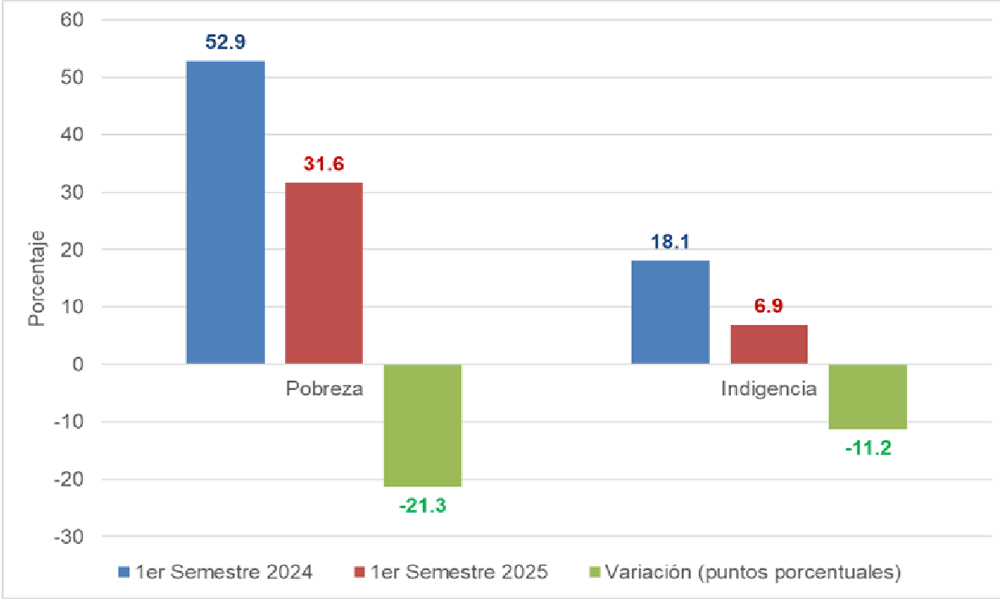
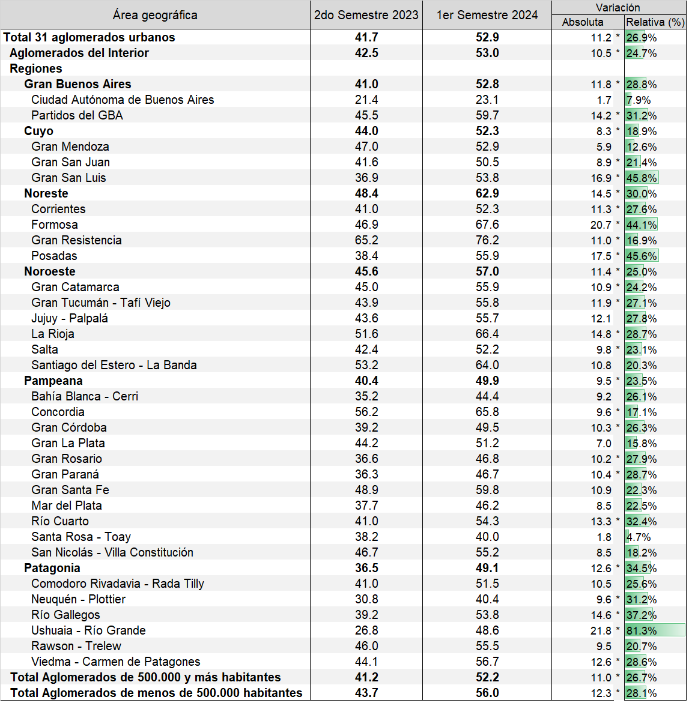
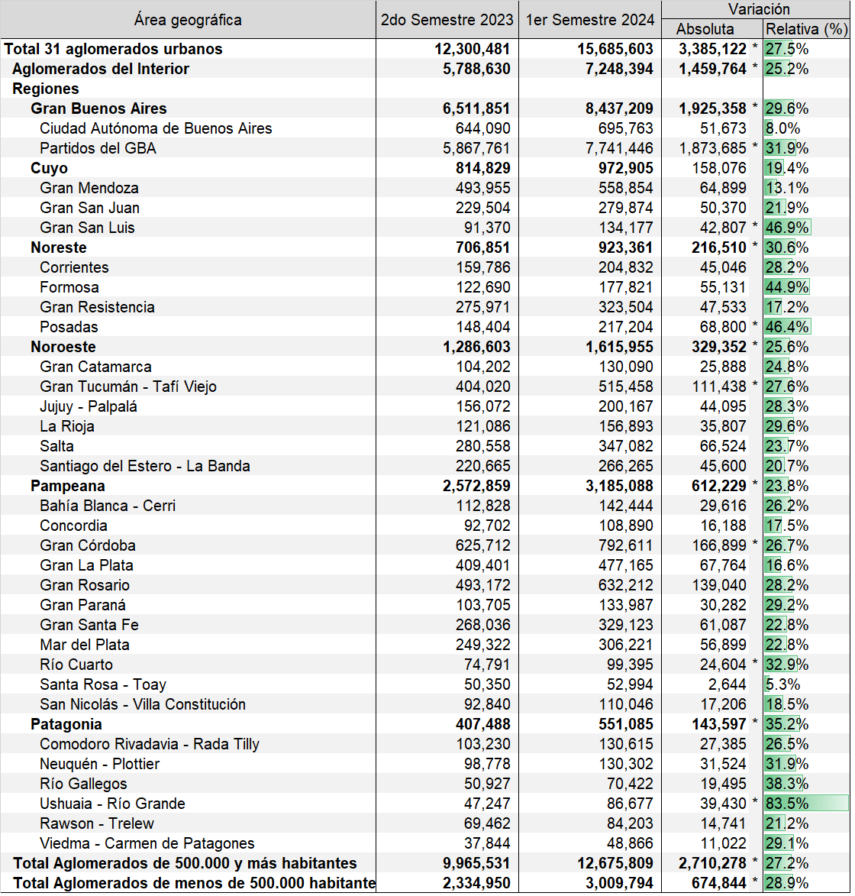
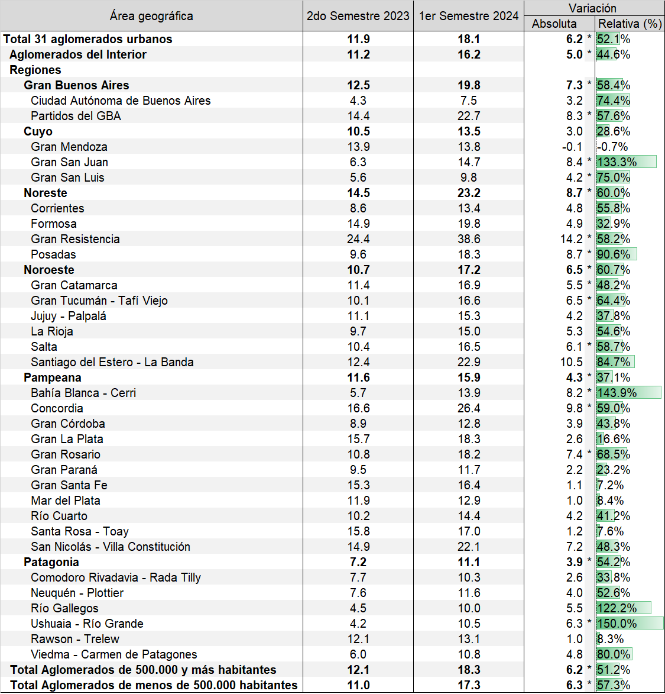
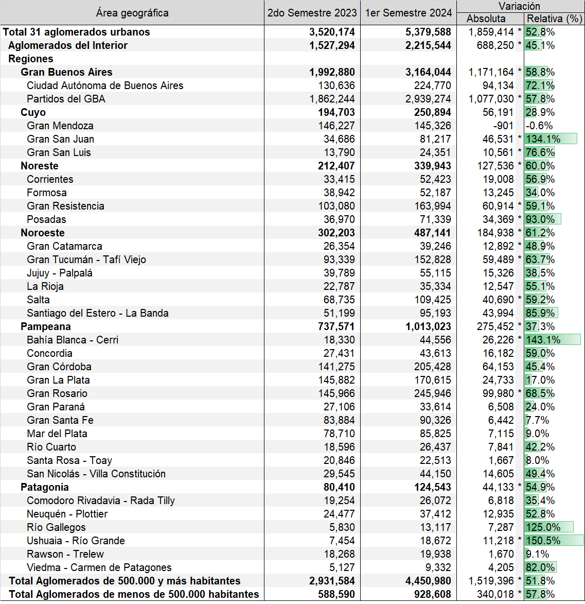
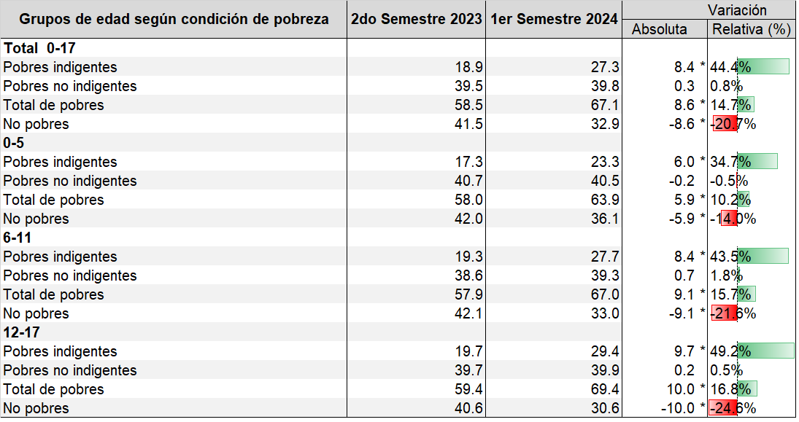

<style>
p {
    font-size: 20px;
    line-height: 28px;
    margin: 0px 0px 12px 0px;
}

h1, h2, h3, h4, h5, h6, legend {
    font-family: Arial, sans-serif;
    font-weight: 700;
    color: #9F2042;
}
</style>

```{r setup, include=FALSE}
knitr::opts_chunk$set(echo = TRUE)
options(knitr.kable.NA = '')
library(tidyverse)
library(kableExtra)
library(plotly)
library(knitr)
library(readxl)
```

**En el primer semestre de 2025, en el total de los 31 aglomerados urbanos capturados por la Encuesta Permanente de Hogares, la tasa de pobreza fue de 31.6 por ciento y la de indigencia 6.9 por ciento. Esto implica una caída de 21.3 puntos porcentuales en la pobreza y de 11.2 puntos porcentuales en la indigencia comparadas con el segundo semestre de 2024.**

**Figura 1. Incidencia de la Pobreza y la Indigencia (en porcentaje). Total de Aglomerados**
```{r fig1screenshot, echo=FALSE, fig.cap="Fuente: elaboración propia a partir de la Encuesta Permanente de Hogares (EPH)", out.width = '100%'}

```

La caída en las incidencias de la pobreza y la indigencia son estadísticamente significativos (Cuadros 1 y 3) e implican que alrededor de 6.2 millones de personas dejaron de vivir en hogares urbanos pobres y 3.3 millones dejaron de vivir en hogares indigentes entre el primer semestre de 2024 y el primero de 2025 (Cuadros 2 y 4). Estos números indican que **en el primer semestre de 2025 hay 9.5 millones de personas que viven en hogares urbanos pobres y 2.1 millones de personas que viven en hogares indigentes.** La caída en la pobreza fue generalizada en todas las regiones del país. En todas las regiones, excepto Cuyo, la caída interanual superó los 20 puntos porcentuales siendo la región Noroeste donde la caía fue mayor, casi 26 puntos porcentuales y en la región Cuyo la caía fue de 18.5 puntos porcentuales. La caída interanual en la indigencia también fue generalizada. En la región Noreste fue en donde más cayó, casi 15 puntos porcentuales y en la Patagonia es donde menos cayó, 7.3 puntos porcentuales (Cuadros 2 y 4). Tanto en la indigencia como en la pobreza casi no hubo diferencias entre la caída en los aglomerados de menos y más de 500 mil habitantes. Tampoco hubo diferencias entre el total de aglomerados y los aglomerados del interior del país.

**Pobreza e Indigencia por Área Geográfica**

**Región del Gran Buenos Aires:** la caída en la pobreza y la indigencia se explica principalmente por la situación en los partidos del conurbano bonaerense donde la tasa de pobreza pasó de 59.7 a 35.3 por ciento y la de indigencia de 22.7 a 8.8 por ciento. En la Ciudad Autónoma de Buenos Aires la tasa de pobreza cayó 8.0 puntos porcentuales y la de indigencia 4.0 puntos porcentuales (Cuadros 1 y 3). La caída interanual de la pobreza en los partidos del conurbano implicó que en el primer semestre de 2025 haya 3.1 millones de personas menos, que en el primero de 2024, que viven en hogares pobres (Cuadro 2).

**Región Cuyo:** la incidencia de la pobreza disminuyó 18.5 puntos porcentuales entre el primer semestre de 2024 y el primero de 2025. La caída fue impulsado por el aglomerado del Gran San Luis, donde la pobreza cayó más de 23 puntos porcentuales. Por otro lado, en el Gran San Juan la pobreza se cayó 14.5 puntos porcentuales pasando de 50.5 por ciento en el primer semestre de 2024 a 36.0 por ciento en el primero de 2025 (Cuadro 1). En esta región, la caída de la indigencia en términos interanuales fue d 9.0 puntos porcentuales liderada por los aglomerados de Gran Mendoza y Gran San Juan.

**Región Noreste:** la tasa de pobreza cayó casi 24 puntos porcentuales mientras que la de indigencia cayó 14.7 puntos porcentuales entre el primer semestre de 2024 y el primero de 2025. Es la región que aún tiene las mayores tasas de pobreza, 39.0 por ciento, y de indigencia, 8.5 por ciento, del país (Cuadros 1 y 3). La caída en la tasa de pobreza se explica principalmente por lo sucedido en el aglomerado de Formosa donde cayó alrededor de 39 puntos porcentuales pasando de 67.6 por ciento en el primer semestre de 2024 a 28.3 por ciento en el primer semestre de 2025 (Cuadro 1).La cíad en la tasa de indigencia estuvo impulsada por lo acontecido en el aglomerado de Gran Resistencia donde cayó 23.1 puntos porcentuales y alcanzó un valor de 15.5 por ciento (Cuadro 3). La caída de la pobreza en la región implicó que alrededor de 214 mil personas dejaron de vivir en hogares pobres entre el primer semestre de 2024 y el primero de 2025 (Cuadro 2).

**Región Noroeste:** la tasa de pobreza pasó de 57.0 por ciento a 31.2 por ciento y la tasa de indigencia indigencia de 17.2 por ciento a 4.4 por ciento entre el primer semestre de 2024 y el primero de 2025. La caída interanual en la indigencia fue impulsada por el aglomerado de Santiago del Estero - La Banda donde cayó alrededor de 18 puntos porcentuales; mientras que la caída de la pobreza se explica por lo ocurrido en los aglomerados de Santiago del Estero - La Banda y La Rioja donde cayó más de 30 puntos porcentuales. En La Rioja pasó de 66.4 por ciento en el primer semestre de 2024 a 32.4 por ciento en el primero de 2025 (Cuadros 1 y 3).

**Región Pampeana:** la tasa de pobreza cayó casi 20 puntos porcentuales en la comparación con el primer semestre de 2024 alcanzando 30.5 por ciento en el primer semestre de 2025; mientras que la incidencia de la indigencia llegó al 6.4 por ciento en el primer semestre de 2025 (Cuadros 1 y 3). La caída de la pobreza fue homogénea en los aglomerados que componen la región. Pueden destacarse los aglomerados de Santa Rosa - Toay que es donde menos caída hubo, mientras que en el aglomerado de Río Cuarto la pobreza cayó casi 30 puntos porcentuales ubicándose en 24.4 por ciento en el primer semestre de 2025 (Cuadro 1). La tasa de indigencia llegó a 6.4 por ciento en el primer semestre de 2025 impulsada por la caída en los aglomerados de Concordia y San Nicolás -Villa Constitución (Cuadro 3).

**Región Patagonia:** la ´pobreza tuvo una caída de 22.1 puntos porcentuales miestras que la indigencia cayó 7.3 puntos porcentuales en comparación con el primer semestre de 2024. Ambas caídas resultaron estadísticamente significativas (Cuadros 1 y 3). En términos poblacionales la pobreza cayó en todos los aglomerados de la región y fue liderada por el aglomeradoViedma - Carmen de Patagones (Cuadro 1). La caída de la indigencia fue impulsada por la disminución en el aglomerados Rawson - Trelew donde pasó de 13.1 por ciento a 3.5 por ciento entre el primer semestre de 2024 y el primero de 2025 (Cuadro 3).

**Cuadro 1: evolución de la pobreza por aglomerado**
```{r fig2screenshot, echo=FALSE, fig.cap="Nota: * indica que la variación es estadísticamente significativa al 5%.", out.width = '100%'}

```

**Cuadro 2: personas que viven en hogares pobres**
```{r fig3screenshot, echo=FALSE, fig.cap="Nota: * indica que la variación es estadísticamente significativa al 5%.", out.width = '100%'}

```

**Cuadro 3: evolución de la indigencia por aglomerado**
```{r fig2p0screenshot, echo=FALSE, fig.cap="Nota: * indica que la variación es estadísticamente significativa al 5%.", out.width = '100%'}

```

**Cuadro 4: personas que viven en hogares indigentes**
```{r fig3p0screenshot, echo=FALSE, fig.cap="Nota: * indica que la variación es estadísticamente significativa al 5%.", out.width = '100%'}

```

**Menores de Edad según Condición de Pobreza**

El porcentaje de menores de 18 años que viven en hogares pobres alcanzó en el primer semestre de 2024 el 67.1 por ciento. Esto es un aumento de 8.6 puntos porcentuales con respecto al segundo semestre de 2023. Este aumento fue impulsado por el porcentaje de menores de 18 años que viven en hogares indigentes que subió de 18.9 por ciento en el segundo semestre de 2023 al 27.3 por ciento en el primero de 2024. El porcentaje de pobres no indigentes se mantuvo estable entre esos dos semestres. Si se desagrega por grupos de edad el comportamiento es homogéneo. En los tres grupos (0 a 5, 6 a 11 y 12 a 17 años) se observa el mismo fenómeno, el porcentaje de menores que viven en hogares pobres aumenta porque aumentan quienes viven en hogares indigentes (Cuadro 5).

**Cuadro 5: pobreza por perfil del jefe de hogar y área geográfica**
```{r fig4screenshot, echo=FALSE, fig.cap="Nota: * indica que la variación es estadísticamente significativa al 5%.", out.width = '100%'}

```

